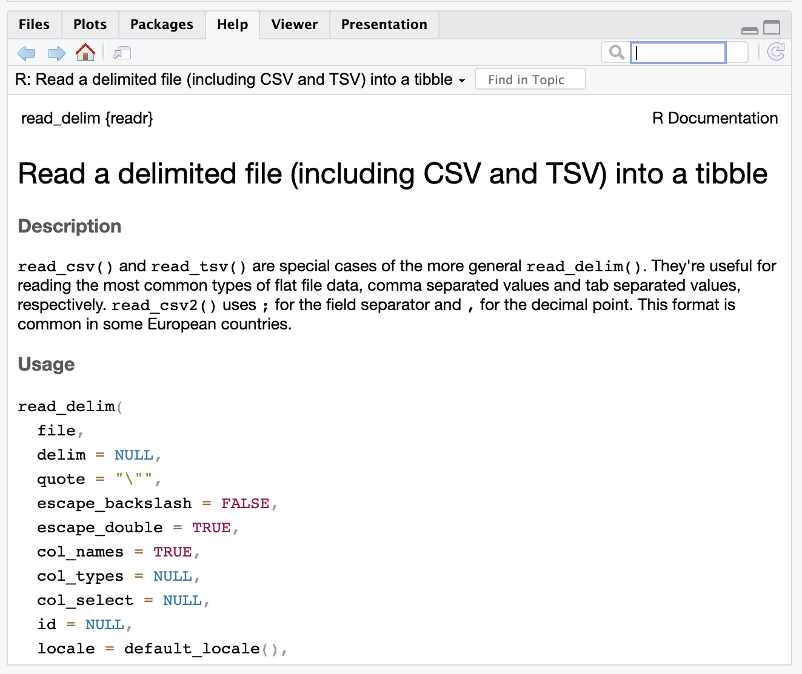

```{r setup, include=FALSE}
knitr::opts_chunk$set(echo = TRUE)
```

# I. Exploring music preferences

#### Task-1

<br>
<br> 

**Question 1.1:** What does the term "CSV" in `playlist_data.csv` stand for, and why is it a popular format for storing tabular data?

**Solution:** "CSV" stand for comma-separated values and indicates that `playlist_data.csv` is a comma-separated values file. It is a popular format for storing tabular data due to its ability to be used across nearly every platform, allowing for ease of data exchange between different systems.
<br>
<br>

**Question 1.2:** Load the `tidyverse` package to work with `.csv` files in R.  

**Solution:** 

```{r,echo=TRUE,eval=TRUE}
# Load the necessary package to work with CSV files in R.
library(tidyverse)
```
<br>

**Question 1.3:** Import the data-set, `playlist_data.csv`

**Solution:** 

```{r,echo=TRUE,eval=TRUE}
# Import the "playlist_data.csv" dataset into R 

read_csv("playlist_data.csv") 

```
<br>

**Question 1.4:** Assign the data-set to a variable, `playlist_data`

**Solution:** 

```{r,echo=TRUE,eval=TRUE}
# Assign the variable to a dataset 

playlist_data <- read_csv("playlist_data.csv") 

```

_From now on, you can use the name of the variable to view the contents of the data-set_
<br>
<br>

**Question 1.5:** Get more information about `read_csv()` command and provide a screenshot of the information displayed in the "Help" tab of the "Files" pane

**Solution:** 

```{r,echo=TRUE,eval=TRUE}
# More information about the R command, complete the code

?read_csv()

```
<br>
```{r, out.height= "400px",out.width= "800px",echo=TRUE,eval=TRUE,fig.cap="Screenshot of information displayed in Help tab"}

```
<br>

**Question 1.6:** What does the `skip` argument in the read_csv() function do?

**Solution:** It shows the number of lines to skip before reading data. If comment is supplied, any commented lines are ignored after skipping.
<br>
<br>

**Question 1.7:** Display the contents of the data-set

**Solution:** 

```{r,echo=TRUE,eval=TRUE}
playlist_data


```
<br>

**Question 1.8:** Assume you have a CSV file named `sales_data.csv` containing information about sales transactions. How would you use the `read_csv()` function to import this file into R and store it in a variable named `sales_data`?

**Solution:** 

```{r,echo=TRUE,eval=TRUE}
# sales_data <- read_csv("sales_data.csv")

```
<br>
<br>

#### Task-2

After learning to import a data-set, let us explore the contents of the data-set through the following questions
<br>
<br>

**Question 2.1:** Display the first few rows of the data-set to get an overview of its structure

**Solution:** 

```{r,echo=TRUE,eval=TRUE}
# Type the name of the variable we assigned the data-set to
head(playlist_data)
```
<br>

**Question 2.2:** Display all the columns of the variable stacked one below another

**Solution:** 

```{r,echo=TRUE,eval=TRUE}
# Stack columns of playlist_data
glimpse(playlist_data)
```
<br>

**Question 2.3:** How many columns are there in the dataset?

**Solution:** 

```{r,echo=TRUE,eval=TRUE}
# Number of columns
ncol(playlist_data)
```
There are 7 columns in the dataset.

<br>
<br>

**Question 2.4:** What is the total count of DJs?

**Solution:** 

```{r,echo=TRUE,eval=TRUE}
# Number of DJs
playlist_data$DJ_Name

```
There is a total of 26 DJs.
<br>

**Question 2.5:** Display all the location of all the DJs

**Solution:** 

```{r,echo=TRUE,eval=TRUE}
# Location of DJs
playlist_data %>% select(DJ_Name,Location)
```
<br>

**Question 2.6:** Display the age of the DJs

**Solution:** 

```{r,echo=TRUE,eval=TRUE}
# Age of DJs
playlist_data %>% select(DJ_Name,Age)
```
<br>
<br>

#### Task-3

Let us plot the data to get more insights about the DJs.
<br>
<br>

**Question 3.1:** Create a plot to visualize the relationship between DJs' ages and their ratings.

**Solution:** 

```{r,echo=TRUE,eval=TRUE}
# complete the code to generate the plot

ggplot(data = playlist_data)  + 
  aes(x=Age,y=Rating)

```
<br>

**Question 3.2:** Label the x-axis as "Age" and the y-axis as "Rating."

**Solution:** 

```{r,echo=TRUE,eval=TRUE}
# complete the code to generate the plot

ggplot(data = playlist_data)  + 
  aes(x=Age,y=Rating) + 
    labs(x="Age",y="Rating.")

```
<br>

**Question 3.3:** Represent data using points

**Solution:** 

```{r,echo=TRUE,eval=TRUE}
# complete the code to generate the plot

ggplot(data = playlist_data)  + 
  aes(x=Age,y=Rating) + 
    geom_point() +
    labs(x="Age",y="Rating.")

```
<br>

**Question 3.4:** Can you change the points represented by dots/small circles to any other shape of your liking?

**Solution:** 

```{r,echo=TRUE,eval=TRUE}
# complete the code to generate the plot

ggplot(data = playlist_data)  + 
  aes(x=Age,y=Rating) + 
    geom_point(shape = 24) +
    labs(x="Age",y="Rating.")

```
<br>

**Question 3.5:** Insert a suitable title and briefly provide your insights in the caption

**Solution:** 

```{r,echo=TRUE,eval=TRUE}
# complete the code to generate the plot

ggplot(data = playlist_data)  + 
  aes(x=Age,y=Rating) + 
    geom_point(shape = 24) +
    labs(x="Age",y="Rating.",
          title="Age versus Rating",
            caption="Generally, age and rating have a weak positive association.")

```
<br>

